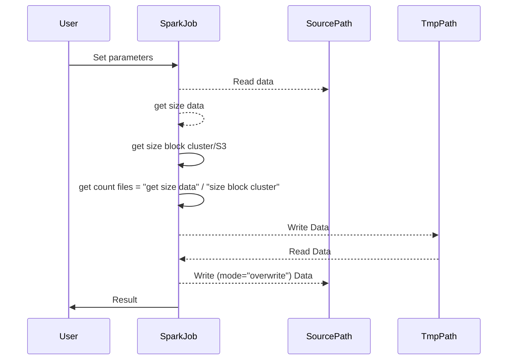

## Description consolidation files in folders or in database tables.

```mermaid
sequenceDiagram
  User ->> SparkJob: Set parameters 
  SparkJob -->> SourcePath: Read data
  SparkJob -->>SparkJob: get size data
  SparkJob ->> SparkJob: get size block cluster/S3
  SparkJob ->> SparkJob: get count files = "get size data" / "size block cluster"
  SparkJob-->> TmpPath: Write Data
  TmpPath -->>SparkJob: Read Data
  SparkJob -->>SourcePath: Write (mode="overwrite") Data
  SparkJob ->> User: Result


```